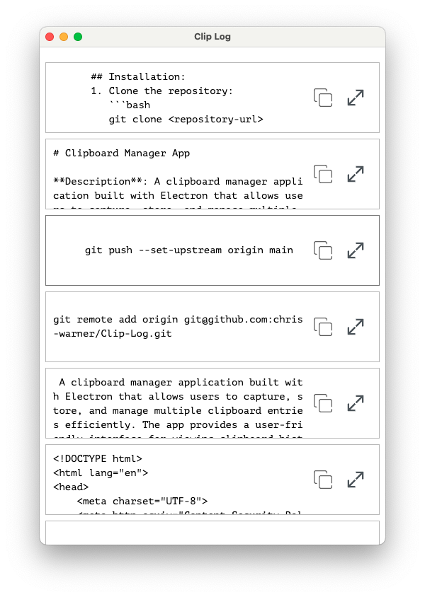

# Clipboard Manager App

**Description**: A clipboard manager application built with Electron that allows users to capture, store, and manage multiple clipboard entries efficiently. The app provides a user-friendly interface for viewing clipboard history, copying text to the clipboard, and expanding individual entries for detailed viewing.

## Key Features:
- **Real-time Clipboard Monitoring**: Automatically detects and captures clipboard text as it is copied.
- **Duplicate Prevention**: Tracks added texts to avoid duplicates in the clipboard history.
- **Expandable Entries**: Each clipboard entry can be expanded to view more details or context.
- **Clipboard Copy Functionality**: Easily copy any text entry back to the clipboard with a click.
- **Smooth Animations**: Provides a visually appealing experience with smooth transitions and animations.
- **Status Notifications**: Displays status messages when text is copied, enhancing user feedback.

## Technologies Used:
- **Electron**: For building cross-platform desktop applications using web technologies (HTML, CSS, JavaScript).
- **JavaScript (ES6)**: For app logic and functionality.
- **CSS**: For styling and layout.

## Installation:
1. Clone the repository
2. Run yarn install
3. Run yarn start to launch the application in developer mode
4. Run yarn make and or package to build app for distobution

    

